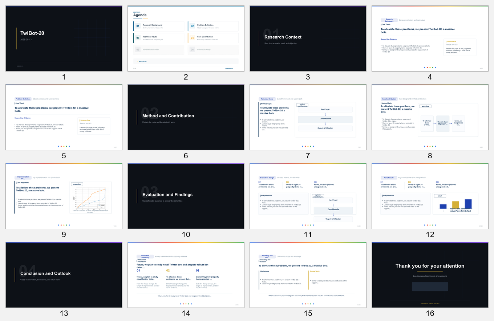

# Academic PPT Skill

[English](README.md)

Academic PPT Skill 是一个开源 skill 仓库，用于把本地论文材料整理成结构严谨、内容精炼、可继续编辑的学术答辩 PPT。

适用场景：

- 本科毕业答辩
- 研究生科研汇报
- 项目中期或阶段性答辩
- 实验室或课程学术汇报

## 最终产物

本仓库默认生成：

- 可编辑的 `.pptx`
- 可重建的 JavaScript 生成源码
- `deck_plan.md`
- `deck_plan.json`
- `source_manifest.json`
- 幻灯片渲染预览图
- 文本溢出、渲染、字体检查结果

## 支持的输入

- `.doc`
- `.docx`
- `.pdf`
- `.md`
- `.pptx`
- `.png`、`.jpg`、`.jpeg`、`.svg`、`.webp` 等图片

输入形式可以是：

- 单个文件
- 多个文件
- 一个混合材料目录

## 核心特点

- 不是通用模板填空，而是基于内容做答辩规划
- 通过 JavaScript 生成可编辑的 PowerPoint
- 强调学生自己的工作、方法、证据链和创新点
- 有原始论文图和截图时优先复用
- 交付前做验证
- 可以追溯回原始材料

## 文档导航

如果你需要：

- 项目说明：当前文件
- 英文项目说明：[README.md](README.md)
- 英文部署文档：[DEPLOYMENT.md](DEPLOYMENT.md)
- 中文部署文档：[DEPLOYMENT.zh-CN.md](DEPLOYMENT.zh-CN.md)
- skill 行为和内部工作流：[skill/academic-ppt/SKILL.md](skill/academic-ppt/SKILL.md)
- 命令级工作流参考：[skill/academic-ppt/references/workflow.md](skill/academic-ppt/references/workflow.md)

## 部署摘要

这个项目有两个实际可用的部署目标：

| 模式 | 结果 | 必要工具 |
| --- | --- | --- |
| 最小运行 | 生成 PPT，但不做完整验证 | Python、Node.js |
| 完整验证 | 生成 PPT，并完成渲染、图像、字体验证 | Python、Node.js、LibreOffice、Poppler、fontconfig |

`draw.io` / `diagrams.net` 桌面版是可选项，只在导出 `.drawio` 为 PNG 时需要。

完整部署说明见：

- [DEPLOYMENT.md](DEPLOYMENT.md)
- [DEPLOYMENT.zh-CN.md](DEPLOYMENT.zh-CN.md)

## 仓库结构

```text
academic-ppt-skills/
|- README.md
|- README.zh-CN.md
|- DEPLOYMENT.md
|- DEPLOYMENT.zh-CN.md
|- LICENSE
|- THIRD_PARTY_NOTICES.md
|- examples/
|  `- twibot20/
`- skill/
   `- academic-ppt/
      |- SKILL.md
      |- package.json
      |- requirements.txt
      |- assets/
      |- references/
      `- scripts/
```

## 示例输出

下图是基于本地研究论文 `TwiBot-20.pdf` 生成的公开示例预览图。原始论文 PDF 不包含在本仓库中。



示例上下文和验证说明见 [examples/twibot20/README.md](examples/twibot20/README.md)。

## 补充文档

- [skill/academic-ppt/SKILL.md](skill/academic-ppt/SKILL.md)
- [skill/academic-ppt/references/workflow.md](skill/academic-ppt/references/workflow.md)
- [REPOSITORY_FOOTPRINT.md](REPOSITORY_FOOTPRINT.md)
- [THIRD_PARTY_NOTICES.md](THIRD_PARTY_NOTICES.md)

## 开源参考

当前已注明的参考项目：

- [hugohe3/ppt-master](https://github.com/hugohe3/ppt-master)
- [op7418/guizang-ppt-skill](https://github.com/op7418/guizang-ppt-skill)
- [gitbrent/PptxGenJS](https://github.com/gitbrent/PptxGenJS)

## 许可证

本仓库采用 MIT License，见 [LICENSE](LICENSE)。
